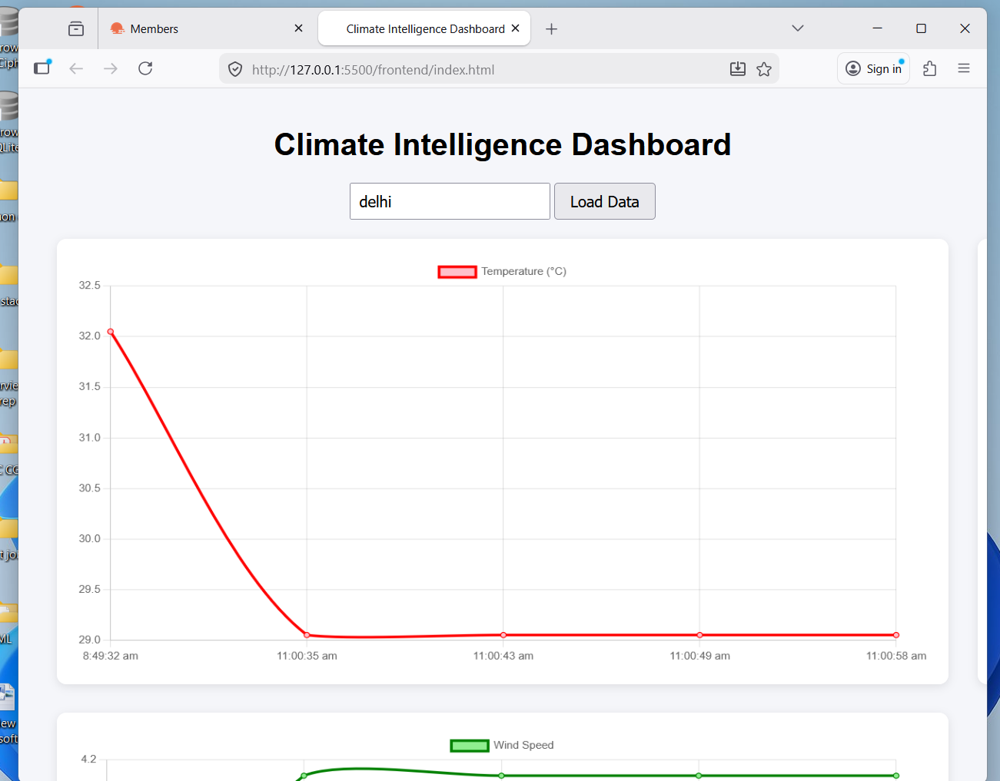
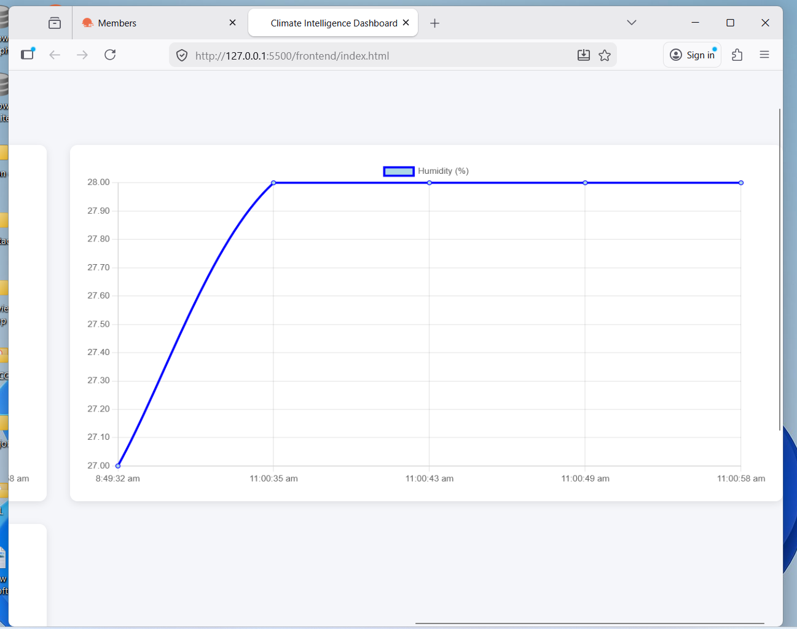
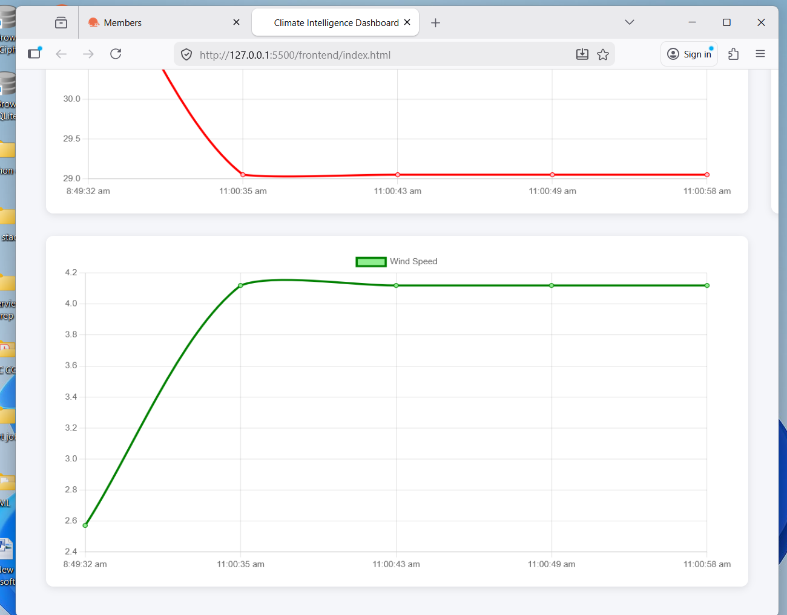

# 🌍 Climate Intelligence System

A full-stack climate analytics platform that collects real-time weather data, stores it in a PostgreSQL database, performs climate analysis, and visualizes results using a live dashboard.

---

## 📊 Dashboard

---

## 🚀 Features

- Real-time weather data collection
- Automated weather data pipeline
- Climate trend analysis
- Heatwave detection
- Live monitoring dashboard
- Automatic data refresh

---

## ⚙️ Tech Stack

### Backend
- FastAPI
- PostgreSQL
- SQLAlchemy
- APScheduler

### Data Analysis
- Pandas
- NumPy

### Frontend
- HTML
- JavaScript
- Chart.js

### External APIs
- OpenWeather API

---

## 🏗 System Architecture

Weather API  
↓  
FastAPI Backend  
↓  
PostgreSQL Database  
↓  
Pandas Analytics  
↓  
Dashboard (Chart.js)

---

## 📡 API Endpoints

### Fetch Weather

POST /weather/fetch/{city}

Fetches weather data and stores it in the database.

---

### Weather History

GET /history/{city}

Returns historical weather data.

---

### Climate Analytics

GET /analytics/{city}

Returns average, max, and min temperature.

---

### Heatwave Detection

GET /heatwave/{city}

Detects heatwave risk based on temperature patterns.

---

## FastAPI Swagger UI

---

## API Docs

http://127.0.0.1:8000/docs

---

## ⚡ Installation

Clone the repository

git clone https://github.com/dharanidhar28/climate-intelligence-system.git

Install dependencies

pip install -r requirements.txt

Run the backend

uvicorn main:app --reload

Open dashboard

frontend/index.html

---

## 📈 Future Improvements

- Machine learning based climate prediction
- Cloud deployment
- Real-time streaming data
- Advanced climate analytics
